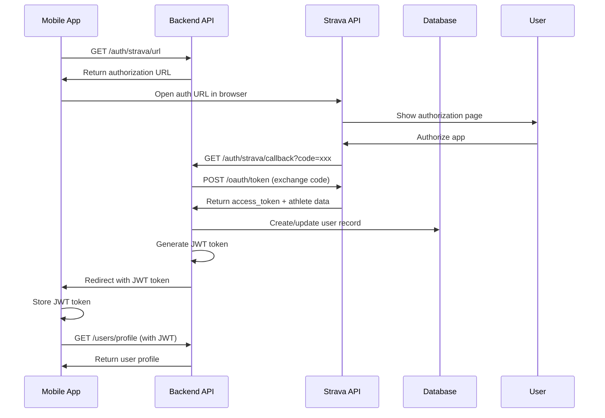

# Authentication API

## Overview
RESTful API endpoints for handling Strava OAuth authentication and JWT token management.

## Base URL
```
http://localhost:3000/api/auth
```

## Endpoints

### GET /strava/url
Generate Strava OAuth authorization URL for mobile app authentication.

#### Request
```http
GET /api/auth/strava/url
```

#### Response
```json
{
  "success": true,
  "data": {
    "authUrl": "https://www.strava.com/oauth/authorize?client_id=112442&redirect_uri=http%3A%2F%2Flocalhost%3A3000%2Fapi%2Fauth%2Fstrava%2Fcallback&response_type=code&scope=read%2Cactivity%3Aread"
  }
}
```

#### Usage Flow
1. Mobile app calls this endpoint
2. Opens returned `authUrl` in browser
3. User completes Strava OAuth flow
4. Strava redirects to callback endpoint

---

### GET /strava/callback
Handle OAuth callback from Strava and exchange authorization code for access tokens.

#### Request
```http
GET /api/auth/strava/callback?code=<authorization_code>&mobile=true
```

#### Query Parameters
- `code` (required): Authorization code from Strava
- `mobile` (optional): If "true", redirects to mobile app deep link
- `error` (optional): Error code if authorization was denied

#### Success Response (Web)
```json
{
  "success": true,
  "data": {
    "token": "eyJhbGciOiJIUzI1NiIsInR5cCI6IkpXVCJ9...",
    "user": {
      "id": 1,
      "stravaId": "12345",
      "firstName": "John",
      "lastName": "Doe", 
      "currency": 500
    }
  }
}
```

#### Success Response (Mobile)
```http
HTTP/1.1 302 Found
Location: endurancevault://auth?token=eyJhbGciOiJIUzI1NiIsInR5cCI6IkpXVCJ9...
```

#### Error Response
```json
{
  "success": false,
  "error": "Authentication was denied"
}
```

## Authentication Flow

### Complete OAuth Process


## JWT Token Details

### Token Structure
```typescript
// JWT Payload
{
  userId: number,    // Internal user ID
  iat: number,       // Issued at timestamp
  exp: number        // Expiration timestamp (30 days)
}

// JWT Header
{
  alg: "HS256",
  typ: "JWT"
}
```

### Token Usage
```http
Authorization: Bearer <jwt_token>
```

### Token Storage (Mobile)
```typescript
// Stored in Expo SecureStore
await SecureStore.setItemAsync('auth_token', token);

// Retrieved for API calls
const token = await SecureStore.getItemAsync('auth_token');
```

## Error Handling

### Common Error Codes
```typescript
// HTTP Status Codes
400 - Bad Request (missing code, invalid parameters)
401 - Unauthorized (invalid/expired token)
403 - Forbidden (access denied)
500 - Internal Server Error (server/database issues)
```

### Error Response Format
```json
{
  "success": false,
  "error": "Human-readable error message"
}
```

### Specific Error Scenarios

#### User Denies Authorization
```json
{
  "success": false,
  "error": "Authentication was denied"
}
```

#### Missing Authorization Code
```json
{
  "success": false,
  "error": "Authorization code is required"
}
```

#### Strava API Error
```json
{
  "success": false,
  "error": "Authentication failed"
}
```

## Security Considerations

### Environment Variables
```bash
STRAVA_CLIENT_ID=112442
STRAVA_CLIENT_SECRET=your_secret_here
STRAVA_REDIRECT_URI=http://localhost:3000/api/auth/strava/callback
JWT_SECRET=your_jwt_secret_here
```

### Token Security
- JWT tokens expire after 30 days
- Strava access tokens stored securely in database
- No sensitive data exposed in JWT payload
- HTTPS required in production

### Rate Limiting
- Strava API limits: 100 requests per 15 minutes
- Consider implementing request queuing for high usage
- Cache user data to reduce API calls

## Testing

### Manual Testing
```bash
# Get auth URL
curl "http://localhost:3000/api/auth/strava/url"

# Visit returned URL in browser to complete OAuth
# Check callback handling with authorization code
```

### Integration Testing
```typescript
describe('Auth API', () => {
  test('should generate Strava auth URL', async () => {
    const response = await request(app)
      .get('/api/auth/strava/url')
      .expect(200);
      
    expect(response.body.success).toBe(true);
    expect(response.body.data.authUrl).toContain('strava.com/oauth/authorize');
  });
  
  test('should handle OAuth callback', async () => {
    const mockCode = 'test_authorization_code';
    
    // Mock Strava API responses
    nock('https://www.strava.com')
      .post('/oauth/token')
      .reply(200, mockStravaTokenResponse);
    
    const response = await request(app)
      .get(`/api/auth/strava/callback?code=${mockCode}`)
      .expect(200);
      
    expect(response.body.success).toBe(true);
    expect(response.body.data.token).toBeDefined();
  });
});
```